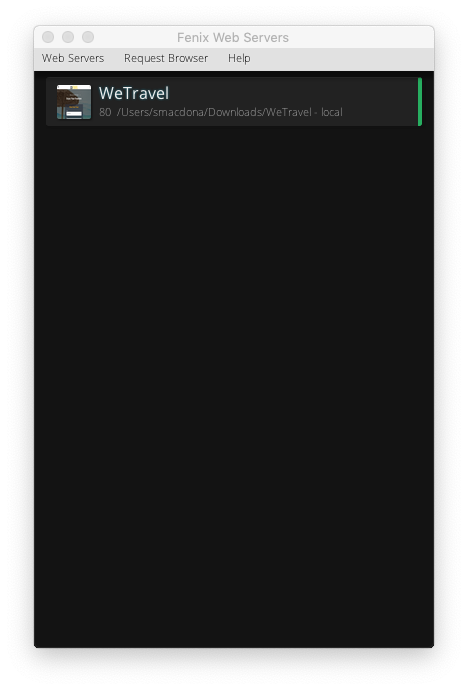
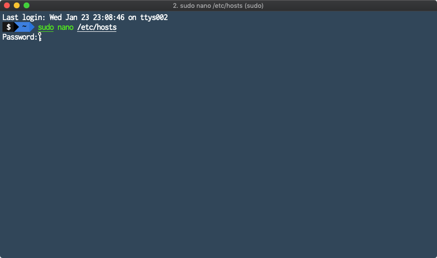
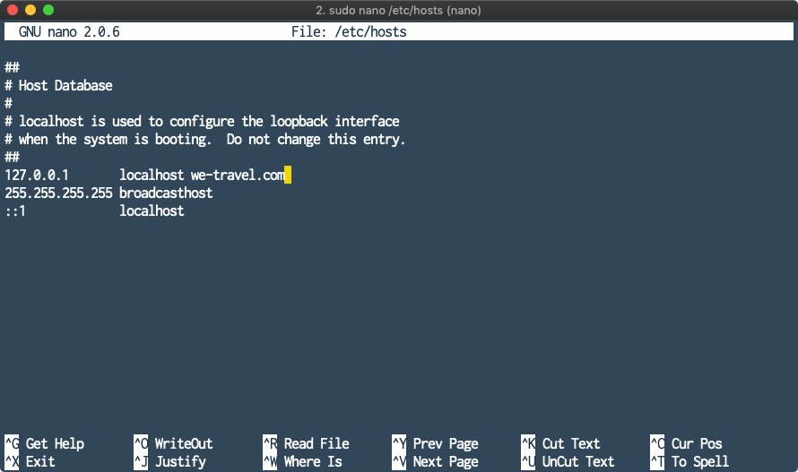

# Chapter 1. Setup: Before you start - Pre-Authorization and Tools

## Learning Objectives

- Understand AdminConsole capabilities for Experience Platform
- Understand the role of Product Profiles
- Access control through service -settings
- Managing users and administrators
- Create your local websever to host a WeTravel demo site for data streaming (Chapter 9)

## Lab Resources

- Experience Platform UI: [https://platform.adobe.com/](https://platform.adobe.com/)
- Adobe I/O Console: [https://console.adobe.io/](https://console.adobe.io/)

## Lab Tasks

- Download Required Tools
- Log into Adobe Experience Platform
  - Create Product Profile
  - Add Users
  - Add as Admin
- Verify Access to Adobe I/O Console
- Install the Fenix Web Server with WeTravel

---

## Download Required Tools

Download the resources listed below and make sure they are accessible on your local.

- [Postman](https://www.getpostman.com/apps)
- [Fenix Web Server](http://fenixwebserver.com/)
  - [WeTravel website files](../data/WeTravel-local.zip)
- PostgreSQL [MacOS](https://www.postgresql.org/download/macosx/) use the Homebrew method or [Windows](https://www.postgresql.org/download/windows/)
- A text editor like [VS Code](https://code.visualstudio.com/download)

For Windows users, please make sure you have **OpenSSL** set up

- Download an OpenSSL client [OpenSSL](https://bintray.com/vszakats/generic/download_file?file_path=openssl-1.1.1-win64-mingw.zip)

Mac users will be able to use the default version of **OpenSSL** included with MacOS.

---

## Login to Admin Console

1. Navigate to [https://adminconsole.adobe.com](https://adminconsole.adobe.com) in your browser
1. Login with the “Lab Administration” administrator credential that are provided on your personal lab-worksheet.

   

1. Select “Adobe Experience Platform”

   

1. Select “New Profile”

   

1. Complete your Product Profile details (for prefix see your Lab worksheet):
   - Profile Name : Profile-&lt;prefix&gt;
   - Display Name : [V] Same as Profile Name
   - Description: Product Profile for &lt;prefix&gt;
   - Disable User notifications
1. Click “Next”

   

1. Select the Services you want to enable for this Product Profile
   - Enable “Data Science Workspace”
   - Enable “Experience Query Service”
1. Select “Done”

   

1. Click on the Product Profile you just created

   

1. Click “Add User”

   

1. Type your own Personal AdobeId (see Lab Worksheet)

   

1. Your user has been added to the Product Profile – you can now login into Experience Platform, but just one more thing…….
1. Go back to “Overview”

   

1. Click “Add Admin”, Add your AdobeId and enable “System Administrator” privileges.
1. Go to [https://platform.adobe.com/](https://platform.adobe.com/)

---

## Verify Access to Adobe I/O Console

- Go to [Adobe I/O Console](https://console.adobe.io/) and ensure you can login using your Adobe ID.

---

## Deploying WeTravel webpage to your machine via Fenix webserver

1.  Download the [WeTravel website](../data/WeTravel-local.zip).
1.  Unzip the `WeTravel-local.zip` file and make note of which directory you extract the content to.
1.  Start the Fenix web server.

    

1.  Select the `Web Servers` menu and click `New`

    

1.  Use `WeTravel` as descriptive name.

    

1.  Click on the folder in the `Directory` input field. Then navigate the file dialog to the directory you unzipped the `WeTravel-local` folder, highlight it and click `Select`.

    

1.  Click `Create`.

    

1.  Click on the `Play` button to start the server.

    

1.  Now your WeTravel site should be ready to be browsed.

    

1.  Navigate to [http://127.0.0.1](http://127.0.0.1) to test the web server. You should see the following:

    

1.  Now we need to redirect requests to `we-travel.com` to our local web server.

    For **MacOS** users:

    - Open the Terminal program.
    - Run the following command:

              sudo nano /etc/hosts

      - You will need to type in your adminstrator password to continue.

      

      - You're now in the Nano text editor. You should see something that looks like this:
      - Use the arrow keys to navigate the cursor to the line:

              127.0.0.1  localhost

      

      - Add `we-travel.com` to the end of the line so it looks like:

              127.0.0.1  localhost   we-travel.com

      

      - Once you're done, hold down the control and O keys to save the file, then control and X to exit.
      - Finally you'll need to restart your Mac's DNS responder by entering the following command into the Terminal:

              sudo killall -HUP mDNSResponder

    For **Windows** users:

    - Press the Windows key.
    - Type **Code** in the search field.
    - In the search results, right-click **Code** and select **Run as administrator**.
      From **Code**, open the following file:

            c:\Windows\System32\Drivers\etc\hosts

    - Add a new line to the end of the file that looks like this:

            127.0.0.1   we-travel.com

    - Click File > Save to save your changes.

1.  Navigate to [http://we-travel.com](http://we-travel.com) to test the web server. You should see the following:

    

---

### Navigate

|**Next:**|
|---|
|Chapter 2 - [XDM and Experience Platform Overview](chapter-2.md)|

**Return Home:** [Workbook Index](../README.md)
