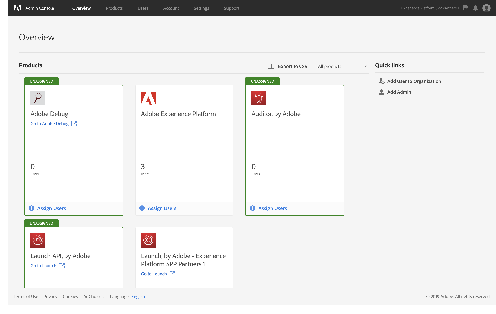
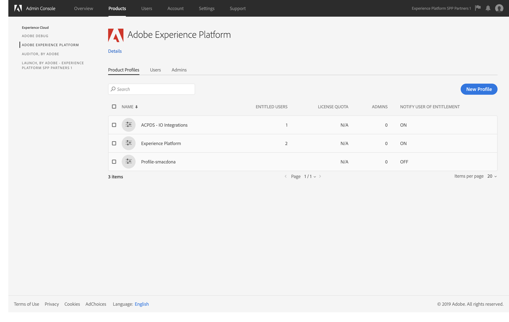

# Chapter 1. Setup: Before you start - Pre-Authorization and Tools

## Learning Objectives

- Understand AdminConsole capabilities for Experience Platform
- Understand the role of Product Profiles
- Access control through service -settings
- Managing users and administrators

## Lab Resources

- Experience Platform UI: [https://platform.adobe.com/](https://platform.adobe.com/)
- Adobe I/O Console: [https://console.adobe.io/](https://console.adobe.io/)

## Lab Tasks

- Download Required Tools
- Log into Adobe Experience Platform
  - Create Product Profile
  - Add Users
  - Add as Admin
- Verify Access to Adobe I/O Console

---

## Setup for Platform (All Users): Login to Admin Console

1. Navigate to [https://adminconsole.adobe.com](https://adminconsole.adobe.com) in your browser
1. Login with the “Lab Administration” administrator credential that are provided on your personal lab-worksheet.

   

1. Select “Adobe Experience Platform”

   

1. Select “New Profile”

   

1. Complete your Product Profile details (for prefix see your Lab worksheet):
   - Profile Name : Profile-&lt;prefix&gt;
   - Display Name : [V] Same as Profile Name
   - Description: Product Profile for &lt;prefix&gt;
   - Disable User notifications
1. Click “Next”

   

1. Select the Services you want to enable for this Product Profile
   - Enable “Data Science Workspace”
   - Enable “Experience Query Service”
1. Select “Done”

   

1. Click on the Product Profile you just created

   

1. Click “Add User”

   

1. Type your own Personal AdobeId (see Lab Worksheet)

   

1. Your user has been added to the Product Profile – you can now login into Experience Platform, but just one more thing…….
1. Go back to “Overview”

   

1. Click “Add Admin”, Add your AdobeId and enable “System Administrator” privileges.
1. Go to [https://platform.adobe.com/](https://platform.adobe.com/)

---

## Setup for API / Technical Lab: Download Required Tools

[Register for API + Technical Lab](http://bit.ly/platform-spp-api) on Day 1 to ensure we have resources scaled properly for your participation

If you are planning on attending the API and Technical lab (Chapters 6-9), download the resources listed below and make sure they are accessible on your local. You do not need to download these or perform the rest of the steps if you are only attending the UI-based lab (Chapters 3-5).

- [Postman](https://www.getpostman.com/apps)
- [Fenix Web Server](http://fenixwebserver.com/)
  - [WeTravel website files](../data/WeTravel-local.zip)
- PostgreSQL [MacOS](https://www.postgresql.org/download/macosx/) use the Homebrew method or [Windows](https://www.postgresql.org/download/windows/)
- A text editor like [VS Code](https://code.visualstudio.com/download)

For Windows users, please make sure you have **OpenSSL** set up

- Download an OpenSSL client [OpenSSL](https://bintray.com/vszakats/generic/download_file?file_path=openssl-1.1.1-win64-mingw.zip)

Mac users will be able to use the default version of **OpenSSL** included with MacOS.

### Verify Access to Adobe I/O Console

- Go to [Adobe I/O Console](https://console.adobe.io/) and ensure you can login using your Adobe ID.

## Additional API + Technical Lab Setup

If time permits during the session, move on to [API Technical Lab Setup](/chapter-6-precursor.md) to set up your environment for API calls, Query Service and a local webserver for Adobe Launch. If time does not permit, have these steps completed before coming into Day 2 lab. Reach out to dumlao@adobe.com or smacdona@adobe.com if there are any outstanding issues prior to coming into Day 2.

- [API Technical Lab Setup](/chapter-6-precursor.md)

---

### Navigate

|**Next:**|
|---|
|Chapter 2 - [XDM and Experience Platform Overview](chapter-2.md)|

**Return Home:** [Workbook Index](../README.md)
