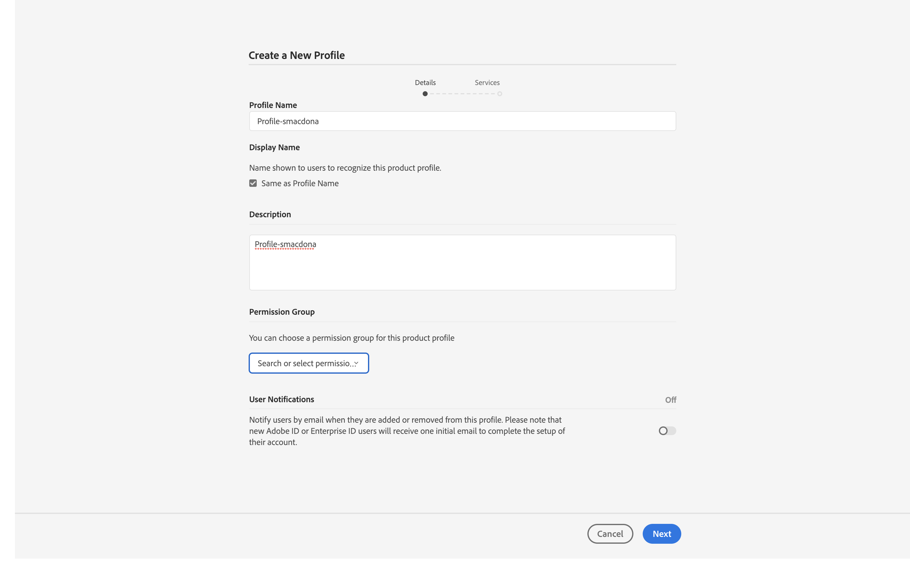
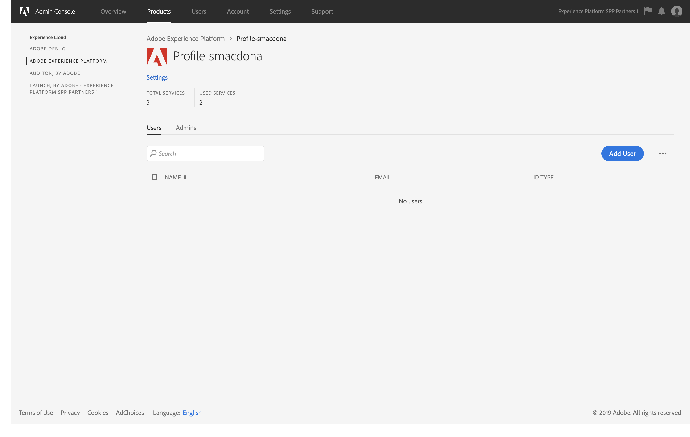
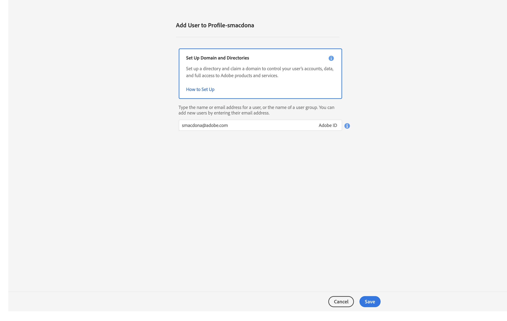
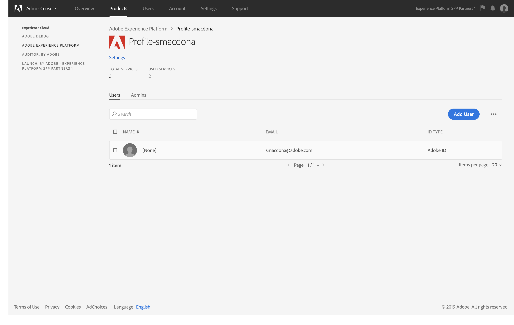

# Chapter 1. Setup: Before you start - Pre-Authorization

## Learning Objectives

- Understand AdminConsole capabilities for Experience Platform
- Understand the role of Product Profiles
- Access control through service -settings
- Managing users and administrators

## Lab Resources

- Experience Platform UI: [https://platform.adobe.com/](https://platform.adobe.com/)
- Adobe I/O Console: [https://console.adobe.io/](https://console.adobe.io/)

## Lab Tasks

- Download Required Tools
- Log into Adobe Experience Platform
  - Create Product Profile
  - Add Users
  - Add as Admin
- Verify Access to Adobe I/O Console

---

## Download Required Tools

Download the resources listed below and make sure they are accessible on your local.

- [Postman](https://www.getpostman.com/apps)
- [Fenix Web Server](http://fenixwebserver.com/)
- PostgreSQL [MacOS](https://www.postgresql.org/download/macosx/) use the Homebrew method or [Windows](https://www.postgresql.org/download/windows/)
- A text editor like [VS Code](https://code.visualstudio.com/download)

For Windows users, please make sure you have **OpenSSL** set up

- Download an OpenSSL client [OpenSSL](https://bintray.com/vszakats/generic/download_file?file_path=openssl-1.1.1-win64-mingw.zip)

Mac users will be able to use the default version of **OpenSSL** included with MacOS.

---

## Login to Admin Console

1. Navigate to [https://adminconsole.adobe.com](https://adminconsole.adobe.com) in your browser
1. Login with the “master credentials for lab” that are provided on your personal lab-worksheet.

   

1. Select “Adobe Experience Platform”

   

1. Select “New Profile”

   

1. Complete your Product Profile details (for prefix see your Lab worksheet):
   - Profile Name : Profile-&lt;prefix&gt;
   - Display Name : [V] Same as Profile Name
   - Description: Product Profile for &lt;prefix&gt;
   - Disable User notifications
1. Click “Next”

   

1. Select the Services you want to enable for this Product Profile
   - Enable “Data Science Workspace”
   - Enable “Experience Query Service”
1. Select “Done”

   

1. Click on the Product Profile you just created

   

1. Click “Add User”

   

1. Type your own Personal AdobeId (see Lab Worksheet)

   

1. Your user has been added to the Product Profile – you can now login into Experience Platform, but just one more thing…….
1. Go back to “Overview”

   

1. Click “Add Admin”, Add your AdobeId and enable “System Administrator” privileges.
1. Go to [https://platform.adobe.com/](https://platform.adobe.com/)

---

## Verify Access to Adobe I/O Console

- Go to [Adobe I/O Console](https://console.adobe.io/) and ensure you can login using your Adobe ID.

---

### Navigate

**Next:** Chapter 2 - [XDM and Experience Platform Overview](chapter-2.md)
