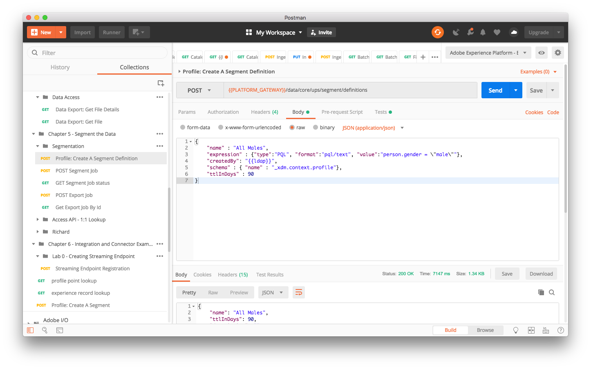
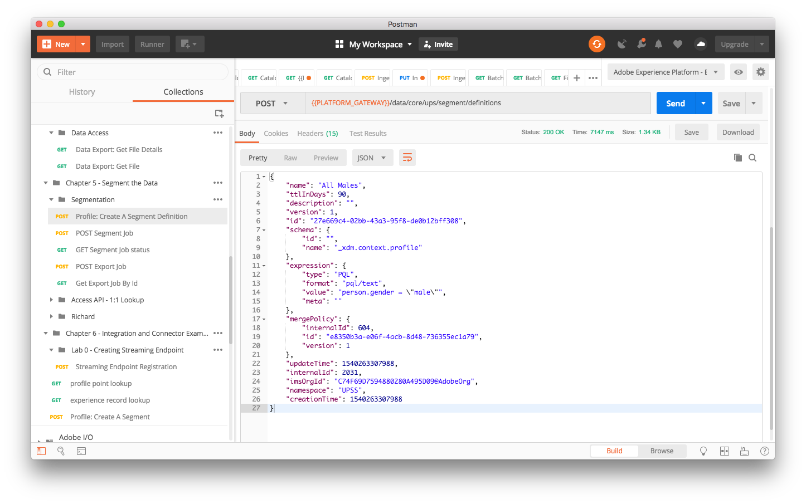
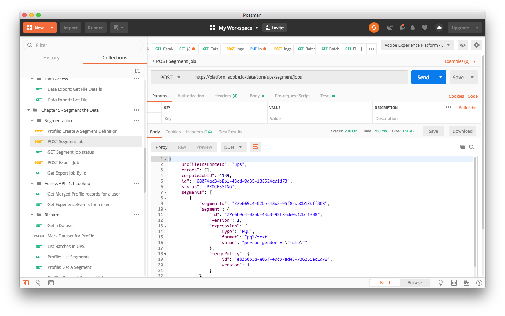
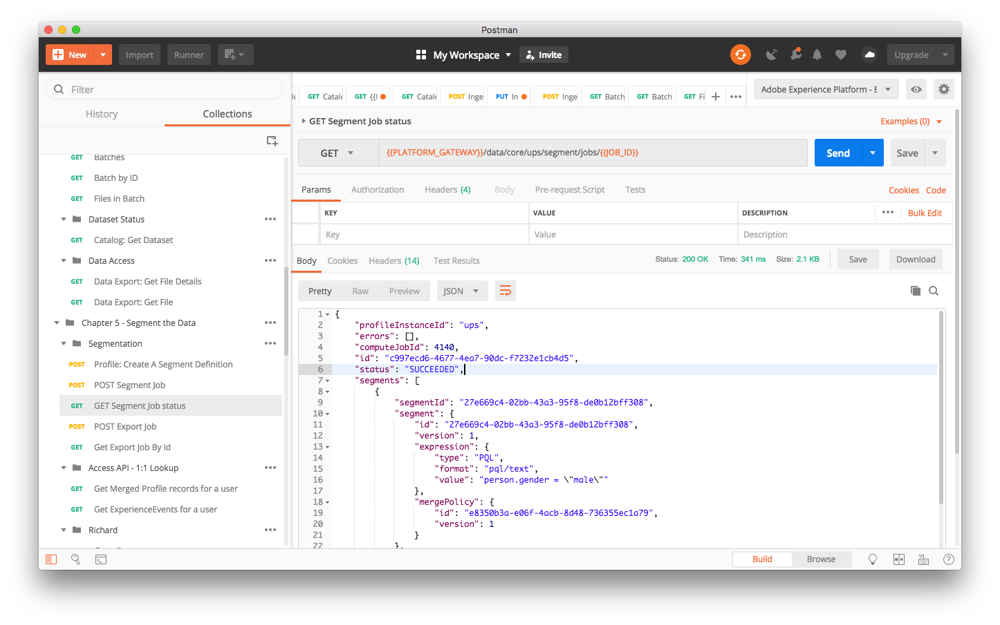
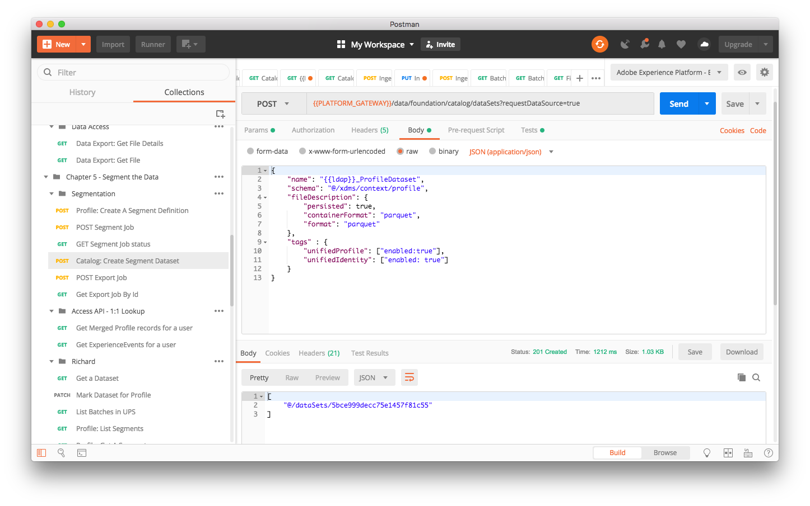
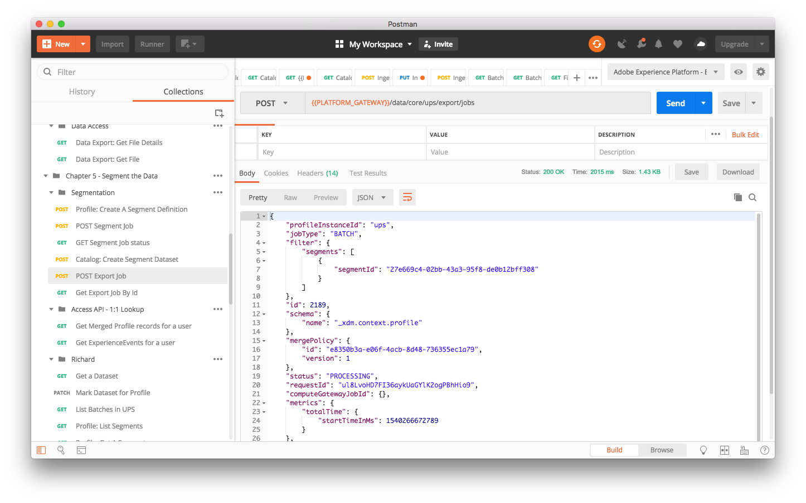
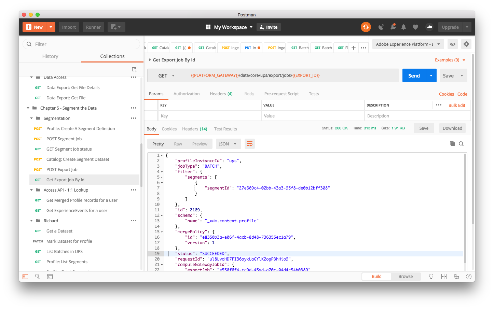
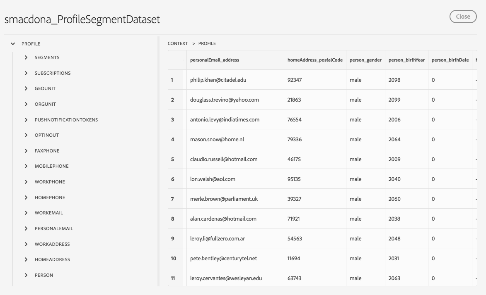

# Bonus Chapter 10. Segmentation: Building Segments from Unified Profiles with the API

## Learning Objectives

- Learn how to segment an audience of Profiles using the API
- Learn how to post segment jobs and export them to a new dataset

## Lab Tasks

- Define a segment via API in JSON
- Create a segment job and export it to a new dataset

---

## Steps

### Segmentation via the API

1.  Now that we've ingested some data in [Chapter 7](/chapters/chapter-7.md) into our Unified Profile service, we're ready to begin segmenting the data in order to gain insights.
1.  Start by expanding the `Chapter 10` & `Segmentation` folder in postman under `Platform Summit`.
1.  Select the `Profile: Create A Segment Definition` action. Note that in the body section of the action we are creating a simple segment that will include all males who have interacted with the system in the past 90 days.

    

1.  Then click `Send` to create the segment and view the results in the response section of postman.

    

1.  Now that we've been able to define a segment the next step is to start a job to run the segment query for us. So select `POST Segment Job` and hit `Send`.

    

1.  A segment job may take a little while to run so let's check on it's status by selecting `GET Segment Job status` and hitting `Send`.

    

    If the `status` property says `PROCESSING` wait a little longer and `Send` the query again until you see `SUCCEEDED`.

1.  Let's create a new dataset to hold the results of our segment job.

    

1.  Now that the job has succeeded and we have a dataset to hold our segmentation data it's time to export the data. Select `POST Export Job` and hit `Send`.

    

1.  We are getting close to being able to view our segment data. Select the `Get Export Job By Id` action and hit `Send`.

    

    If the `status` property says `PROCESSING` wait a little longer and `Send` the query again until you see `SUCCEEDED`.

1.  Now the easiest way to view your segmented dataset is to log in to [https://platform.adobe.com](https://platform.adobe.com), click on the Data tab, then click on {{ldap}}\_ProfileSegmentDataset and finally the `Preview` button.

    

    As you can see all of the people in the dataset are `male`.

---

#### Additional Resources

[Unified Profile, Identity, & Segmentation](https://www.adobe.io/apis/experienceplatform/home/profile-identity-segmentation.html)

---

### Navigate

| **Previous:**                                                                  |
| ------------------------------------------------------------------------------ |
| Chapter 9 - [Technical - Streaming: Stream in Data using Launch](chapter-9.md) |

**Return Home:** [Workbook Index](../README.md)
