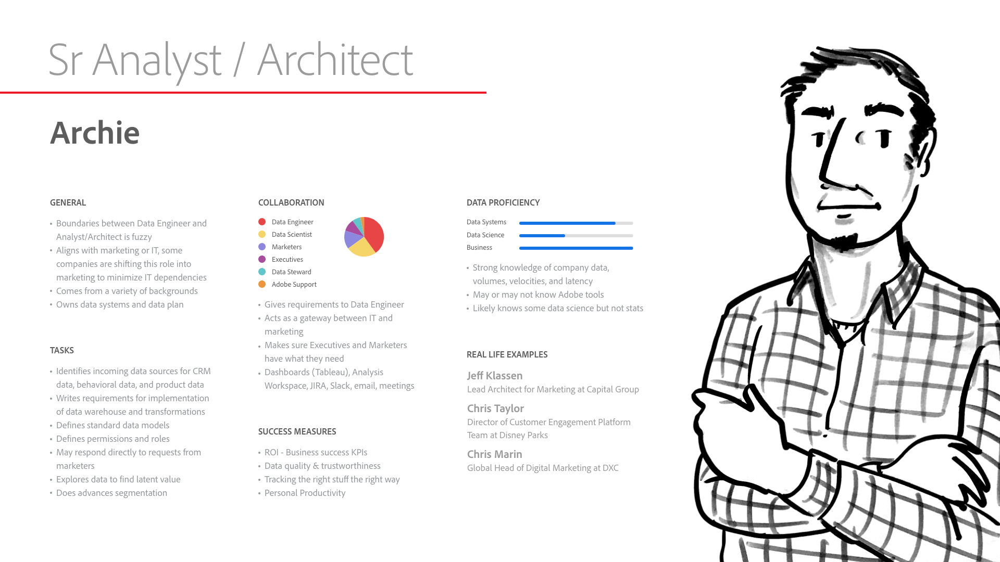
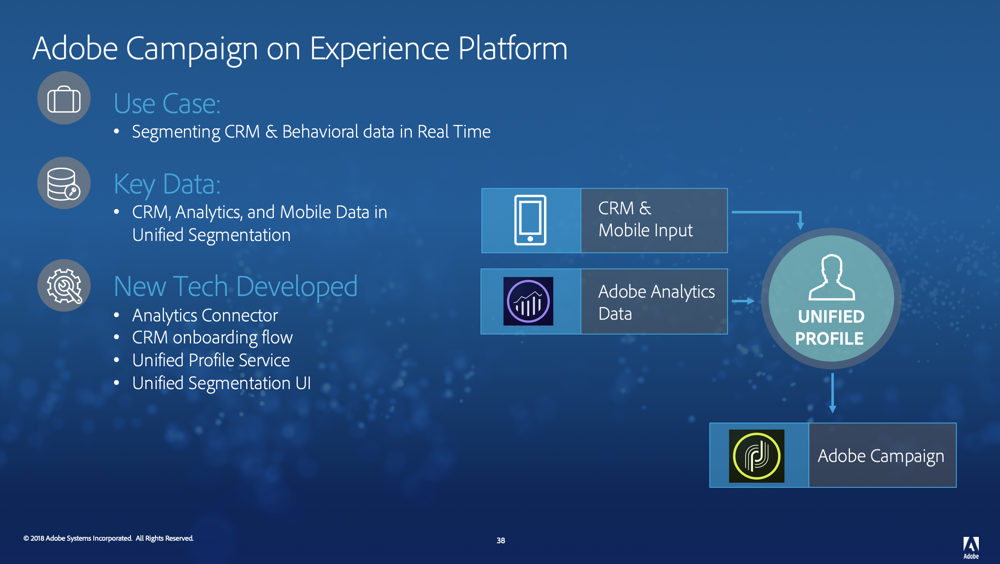

# Chapter 2. Setup: XDM and Experience Platform Overview

## A Story on Experience Platform

A company running a business in Retail or Hospitality can use Adobe Experience Cloud products for a variety of reasons. One of those use cases applicable to these verticals is that of a customer loyalty program. This would include creating a "basis profile" for a specific company's customer, using identifiable information including full name, contact information, and other details. This profile would then serve as a base point to tie additional unique data including transaction history, loyalty program eligibility and status, as well as behavioral data such as online browsing habits to drive promotions and other actions.

Having this "basis profile" established in the Adobe Experience Platform, using a Unified Profile, will give the company the ability to tie multiple sources of data from Experience Cloud products as well as external products built with connections into the Adobe Experience Platform. This will help the company understand a full 360-degree view of each of their customers.

The scope of this workshop covers a portion of this story, that of establishing a basis profile for a company's customers, either through batch ingestion or connector ingestion, in order to begin the foundation for a customer loyalty program built on Adobe Experience Platform.

---

## Personas

The following are the personas designed specifically for Adobe Experience Cloud and Experience Platform. We will occasionally tie back the story of Experience Platform to these personas as we progress through the workshop.

Joe

Adam

Archie

Teresa

---

## Platform Definition

When we think about Adobe Experience Platform, we recognized the need to provide a layer of services that aid in delivering capabilities that enhance experiences. Service capabilities span across the platform from data pipeline all the way to action. We’ve integrated our previous core service layer into platform services, creating a simplified set of services that align to their respective area in the platform.

---

## Unified Profile Service

Our customer loyalty program will be built upon the Unified Profile Service. With this service, data that you ingest into the Experience Platform from multiple channels - CRM services, batch ingestion, streaming Adobe Analytics data, etc. - all combine and associate to individual Unified Profiles for your customers. You can then track and understand not only their Profile data, but attribute their behvavioral data to drive more intelligent insights on their propensities, behaviors, and more. These profiles can be exported through the API, or used within Adobe's Experience Cloud products like Adobe Campaign.

---

## Experience Cloud Integrations

Adobe Campaign is one use-case for Adobe Experience Cloud products living on Experience Platform. Based on a robust, hydrated Unified Profile for your customers, you can segment your customers based on Profile or behavioral attributes - birthday campaigns, re-activation for lost customers, points-based transactional emails, and more. Campaign Experience Platform integrates Experience Platform's Segmentation UI directly to deliver audiences straight from Unified Profile.

---

### Navigate

**Previous:** Chapter 1 - [Setup: Before you start: Pre-Authorization](chapter-1.md)
**Next:** Chapter 3 - [UI: Define the Schema](chapter-3.md)
