# Chapter 4. Ingest the Data

## Learning Objectives

- Learn how to ingest XDM-formatted data files (*.parquet)
- Learn the web UI for data ingestion
- Understand the data governance features of Experience Platform

## Lab Resources

- Experience Platform UI: [https://platform.adobe.com/](https://platform.adobe.com/)
- Sample data .parquet file in Profile XDM format: [ProfileDataSample.parquet](data/ProfileDataSample.parquet)

## Lab Tasks

- Ingest and explore a .parquet file in the Experience Platform UI
- Understand data governance options in Experience Platform UI

## Story: Using the UI

To start the base of the loyalty program, most companies are likely to have existing customer data. Here, we will perform a batch ingestion of an existing data file that contains customer profiles, pre-formatted in Profile XDM format. From the perspective of an Analyst/Architect ("Archie"), this will allow us to start adding customer data to Experience Platform through the web UI interface, as well as preview the ingested datasets to confirm using a snapshot of the data that the file and data has been correctly imported. Some data files may not be properly formatted in to Profile XDM format - in which case, a data ingestion may come up as `failed`. In addition, some fields in our Profile schema may be sensitive information - for example, a customer's address and phone number. These will need to be export-controlled using data governance.

For batch ingestion of data, it is important that the data is properly formatted into XDM prior to bringing it into our customer loyalty database on Experience Platform. Conversion of non-formatted data into Profile XDM will not be covered here, but will be assumed to have been performed prior by a Data Engineer ("Joe"). The initial release of Adobe Experience Platform will include a data-mapping tool for CSV-based data, which we will demonstrate to you after this chapter.

---

## Steps

### Using the Experience Platform Web UI:

1. Let's jump back to the [Web UI interface](https://platform.adobe.com), and click on the "Data" tab. This is where your ingested datasets will reside; once data has been ingested after this lab, it will look similar to this:

   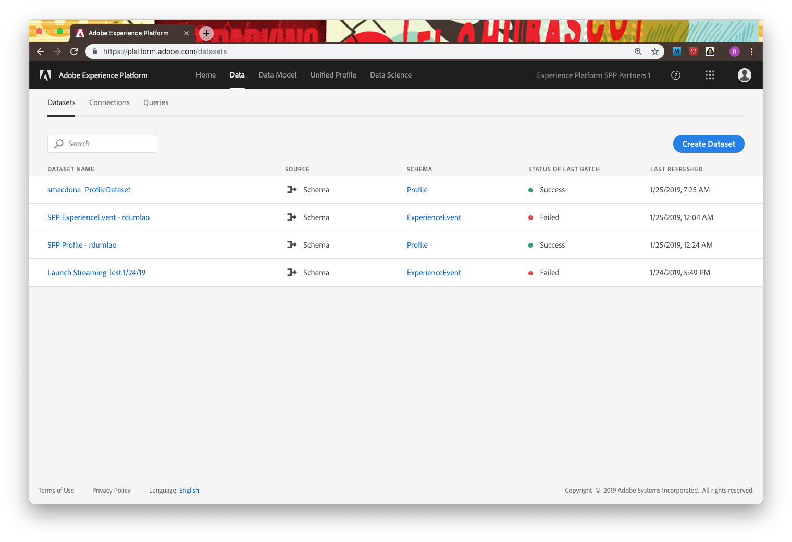

1. We've got a list of datasets, but let's create our own. Click the "Create Dataset" button, and select the "Create Dataset" option under "Schema" after that.

   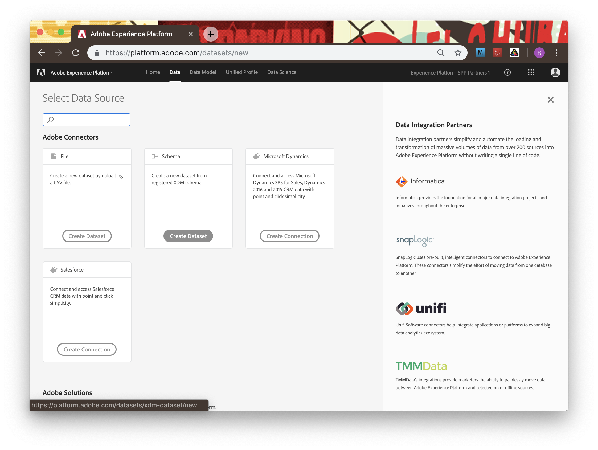

1. Filter the datasets by typing "Profile" in the search box, and select the bottom-most "Profile" schema that pops up. Name your dataset as "SPP Profile - [your first initial + last name]"

   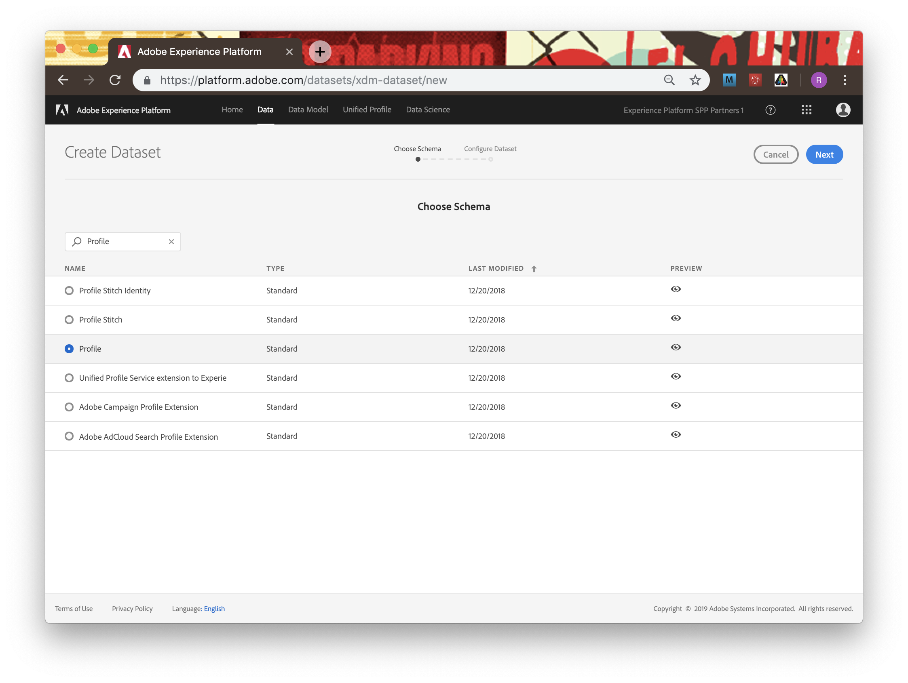

   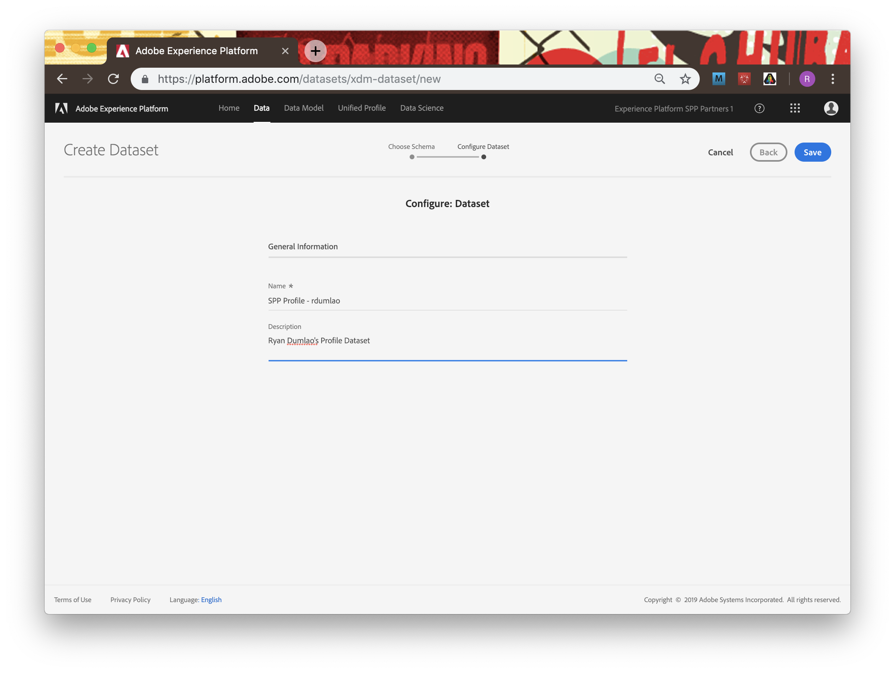

1. Do the same for an "ExperienceEvent" schema-based dataset, naming it "SPP ExperienceEvent - [your first initial + last name]". We will save this for a later chapter.

1. Click on your newly created "SPP Profile" dataset. Select "Browse" under "Add Data" on the right and navigate to the data file we've provided, ProfileDataSample.parquet.

   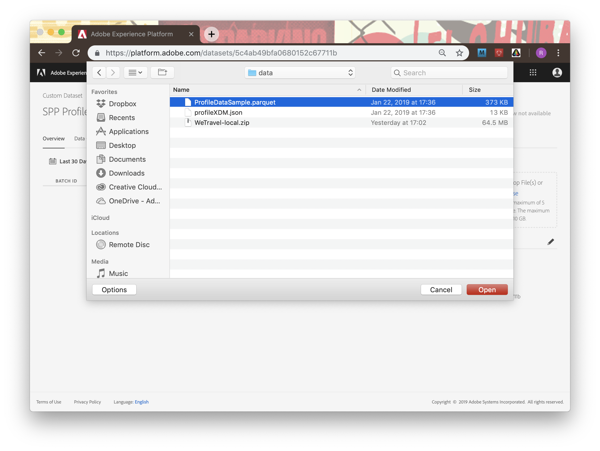

1. Wait a few moments, and then that status of the uploaded file should list as "Success".

   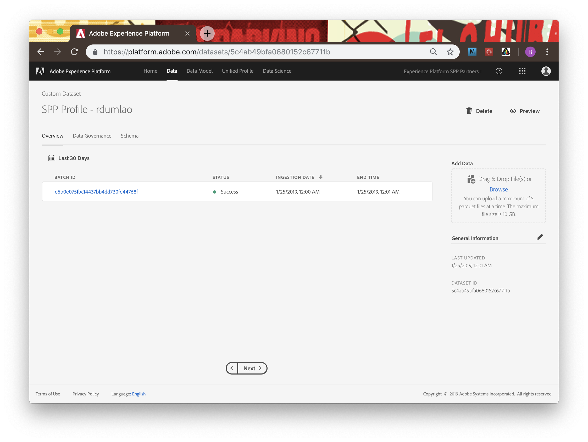

1. Let's take a look at it to make sure our data is in there. Click the "Preview" button to get a quick top-level view of a small sample of the dataset.

   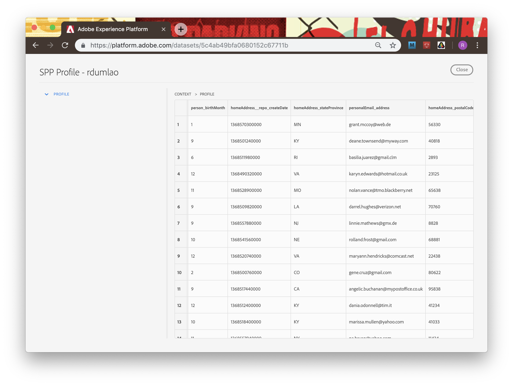

1. We also need to make sure that we enable this dataset for Unified Profile. By default, this needs to be enabled by the user for each dataset. Any datasets tagged for Unified Profile will ingest data for Unified Profile consumption as well, enabling profile-stitchign across datasets and giving a full 360-degree view of a specific profile.

1. go to the "Unified Profile" tab and select "Manage" to manage which datasets are included in Unified Profile.

   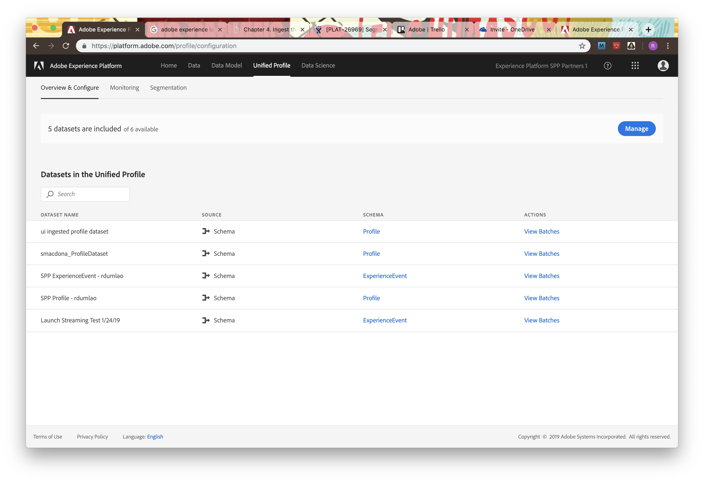

1. Find your Profile and ExperienceEvent datasets in the left list, select them, and then click "Enable", and confirm. Now your datasets will send their data into the Unified Profile service as well as Experience Platform.

   

   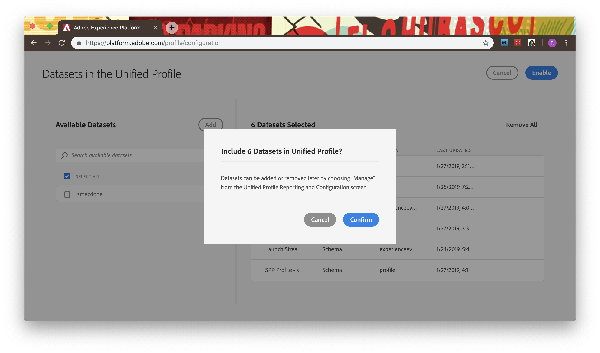

1. [NOT WORKING IN OLD UI] Alright, now that our customer loyalty data has been ingested, we want to make sure that this dataset is properly governed for usage and export control. Click on the "Data Governance" tabe and observe that we can set three types of restrictions: Contractual, Identity, and Sensitive Data.

   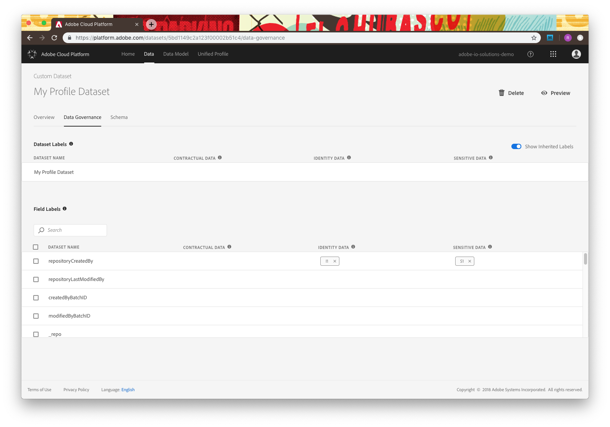

1. [NOT WORKING IN OLD UI] Let's restrict identity data for the entire dataset. Hover over your dataset name, and click the Pencil icon to edit the settings. Go to "Identity Data" and check the "I2" option - this will assume that all pieces of information in this dataset are _at least_ indirectly identifiable to the person.

   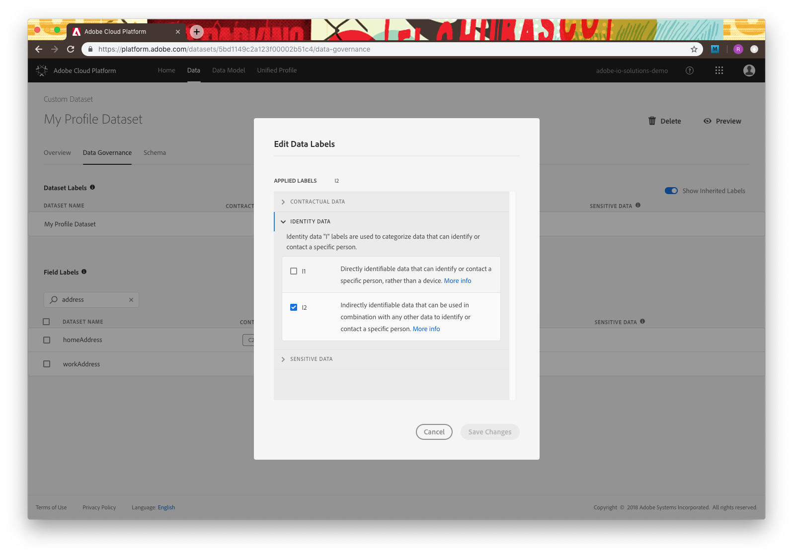

1. [NOT WORKING IN OLD UI] Click "Save Changes" and observe that "I2" is now set for all data fields in the dataset. You can also set these flags for individual data fields - for example, the "person" field is likely an "I1" level for directly identifiable information.

   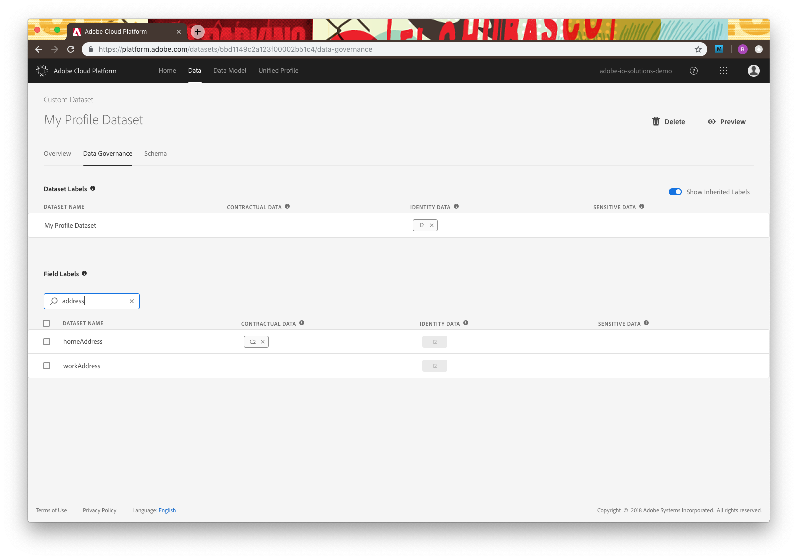

1. Now that we've ingested our profile data into the Unified Profile, we can segment our users using Experience Platform's Segment Builder in Chapter 5. Let's move on.

---

### Navigate

**Previous:** Chapter 3 - [UI: Define the Schema](chapter-3.md)

**Next:** Chapter 5 - [UI: Segment the Data](chapter-5.md)

**Return Home:** [Workbook Index](../README.md)