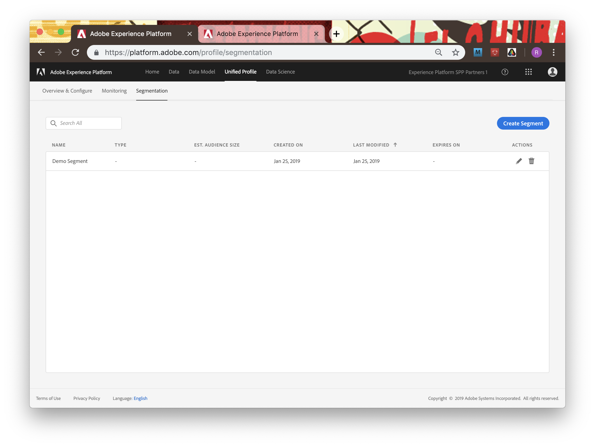

# Chapter 5. Segmentation: Building Segments from Unified Profiles

## Learning Objectives

- Learn how to segment an audience of Profiles
- Demonstrate the power of the Unified Profile

## Lab Tasks

- Define a segment using the Segment Builder within Platform UI

---

## Story

Now that we have a system with customer basis profile data built on the Unified Profile Service and have demonstrated the ability to look up profile data, we can utilize Adobe Experience Platform to take further action. Using either the Segment Builder within the Platform UI or the Experience Platform APIs, Marketers ("Teresa") and Architects ("Archie") can specify filters to segment our database of customers. These segments can then be delivered directly to other platforms, including Adobe Campaign on Platform, where we can create actions built completely from our data that's stored on Experience Platform.

This will help with several aspects of our customer loyalty program, including targeted upgrade promotions, re-engagement or re-activation of customers, garnering insights from the loyalty program statistics, etc. Because all data for a customer including and beyond customer loyalty will be tied to one Unified Profile, we can bring in more information to segment, or use segments for a broader scope of actions.

---

### Segementation via the Segment Builder UI

Let's show how we can visually build a segment - a great tool to look at your Profiles and empower your marketing and analytics.

1.  Head back to the main [Platform UI landing page](https://platform.adobe.com) and click on "Unified Profile", and then click the "Segmentation" tab. Here you'll see the "All Males" segement that we defined in the API already here.

    

1. Click on "New Segment" and name it "All Females" in the "Edit Details" area.

   

1. First thing is to set our filter to define the segment. On the left side you'll see a list of fields based on the schema that make up the data in our Unified Profile database. Search for "gender" in the search box, and drag the first entry (Profile > Person > Gender) to the filter box on the right.

   

1. You'll be promped to select a default value for this field filter based on its possible values. Select "equals" (already selected) and "Female". You'll see the estimate gauge at the top, showing 2750 profiles available, now estimates your filtered segment will contain about 1560 profiles.

   

1. We can nest additional filters onto this segment to make it smaller. Let's say it's September, and we are running a birthday promotion for our female customers. Search for "birth month" in the filter search, and drag the "Profile > Person > Birth month" field under the Gender filter, to add it as an "And", and set it equal to 9.

   

   You will see now that we have a specific segment of 118 profiles that we can target with this promotion! Since we're more specific now, edit the title of the segment to say "September-Born Females" instead.

1. Now that we've found our segment, hit "Create Segment". Now our segment will be saved to the Segmentation list alongside our API-created segment and can be used by other Platform-integrated solutions like Adobe Campaign! (In fact, Adobe Campaign on Experience Platform uses this Segment Builder UI directly inside its audience interface)

   

---

Great work! Now we've run through the basics of setting up your customer loyalty system based on Profile data - defining our data schema, ingesting data for that schema into Unified Profile, and segmenting our Unified Profile entries based on the segments you're targeting. What else can we do with this data now, and how else can we use or integrate into Adobe Experience Platform? We'll cover that next.

#### Additional Resources

[Unified Profile, Identity & Segment Builder Documentation on Adobe I/O](https://www.adobe.io/apis/experienceplatform/home/profile-identity-segmentation.html)

---

### Navigate

|**Previous:**|**Next:**|
|---|---|
|Chapter 4 - [UI -  Data: Ingesting Data via Batch Ingestion](chapter-4.md)|(API AND TECHNICAL LAB) Precursor - [Login and Accessing with Postman](chapter-6-precursor.md)|
