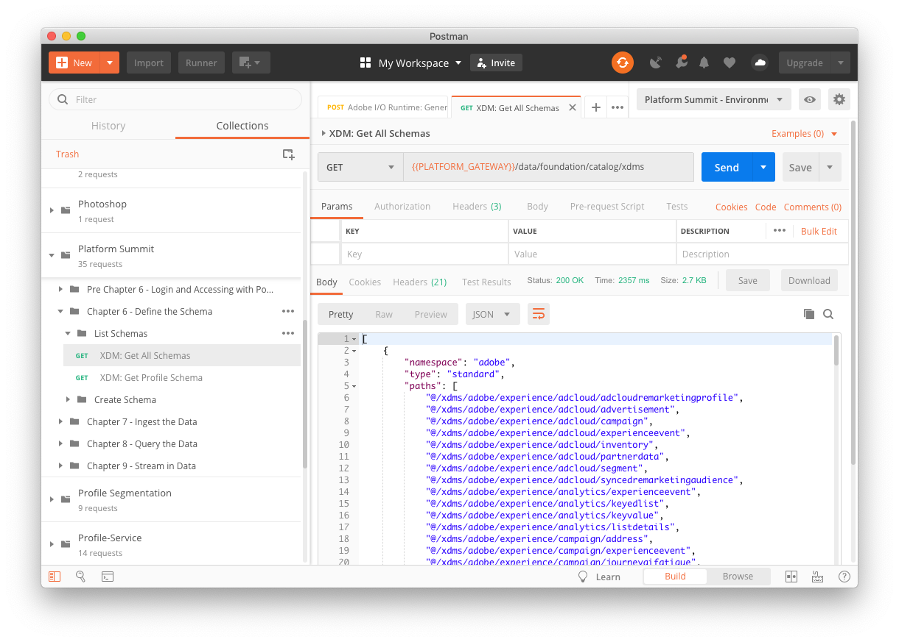
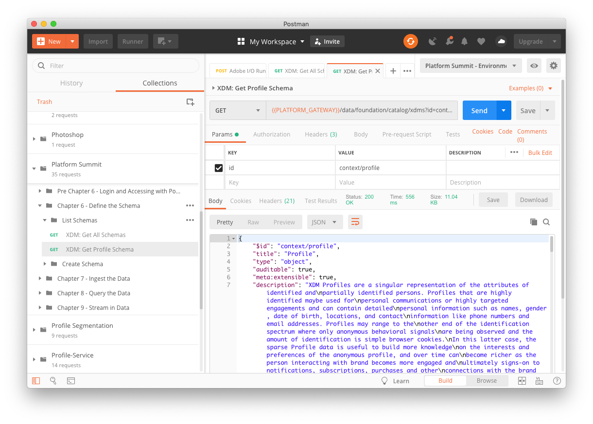
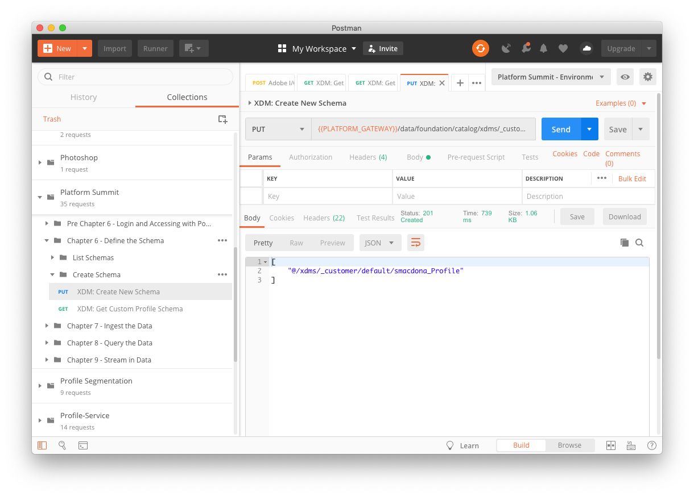
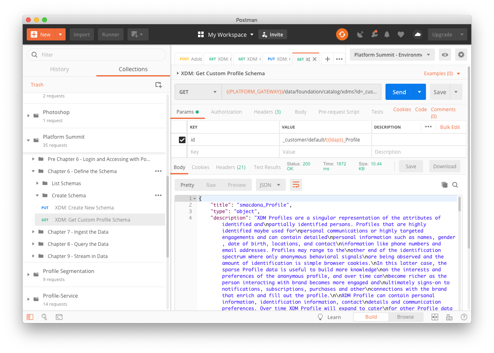

# Chapter 6. Schema: Explore and Define XDM Schema

## Learning Objectives

- Understand the structure of XDM Schema
- Learn to list, lookup, create, and extend schema in API

## Lab Resources

- Profile XDM in JSON format: [ProfileXDM.json](../data/profileXDM.json)

## Lab Tasks

- List all the schemas
- Lookup the Profile schema
- Define a custom Profle schema for use with XDM
- Lookup the custom schema

## Story

While we were able to visually view schema, extend and create custom schema, those tools may not be as optimal for creating large custom schema or viewing schema structure in a more compact format. Perhaps you are more at home with APIs and Postman. In this case, the same suite of abilities (and more) are available to you within the API - if we want to define a new, custom schema, it is likely easier to do so with a JSON representation that we can submit as a POST call rather than defining each field in the UI as we saw in Chapter 4.

---

## Steps

### API: Schema Querying and Creation

1. Now that you've successfuly been authenticated by following the steps in [previous chapter](chapter-6-precursor.md) you are now ready to make API calls.
1. Start by expanding the `Chapter 6` & `List Schemas` folder in postman under `Adobe Experience Platform`.
1. Select the `XDM: Get All Schemas` action and click `Send`.

   

   In the response pane you can scroll down and see all the schemas that are available in XDM.

1. There sure are a lot of schemas available in XDM but let's drill down a bit and view the `profile` schema. If you select `XDM: Get Profile Schema` and click `Send` you should see something similar to:

   

1. Now that we've seen the API calls to query schema let's move on to creating a custom schema of our own. Expand the `Create Schema` folder under `Chapter 3` in postman and select `XDM: Create New Schema` and click `Send`.

   

   In the response section you will the path to your newly created schema which we will be using to create a dataset in `Chapter 7`.

1. Now select `XDM: Get Custom Profile Schema` and click `Send`.

   

   The response section should return the details of the schema which look an awful lot like `Profile` schema. We've included a sample [ProfileXDM.json](../data/profileXDM.json) file in the repository if you'd like to compare them side by side.

With the creation of our custom schema we are ready to move on to the next step of creating datasets and data ingestion.

---

### Navigate

**Previous:** Precursor - [API - Login and Accessing with Postman](chapter-6-precursor.md)

**Next:** Chapter 7 - [API - Data: Ingesting Data via Batch Ingestion](chapter-7.md)

**Return Home:** [Workbook Index](../README.md)
