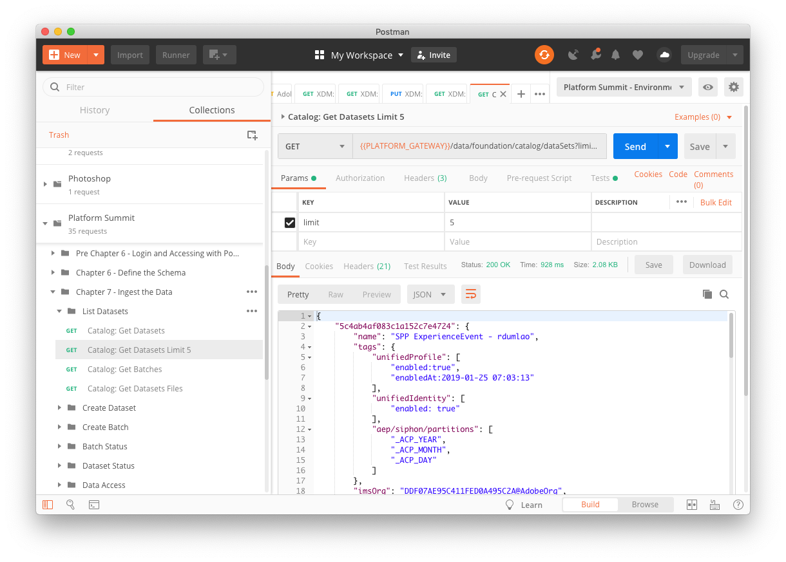
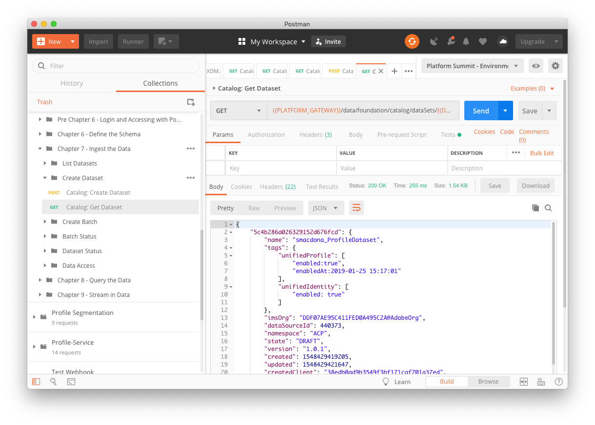
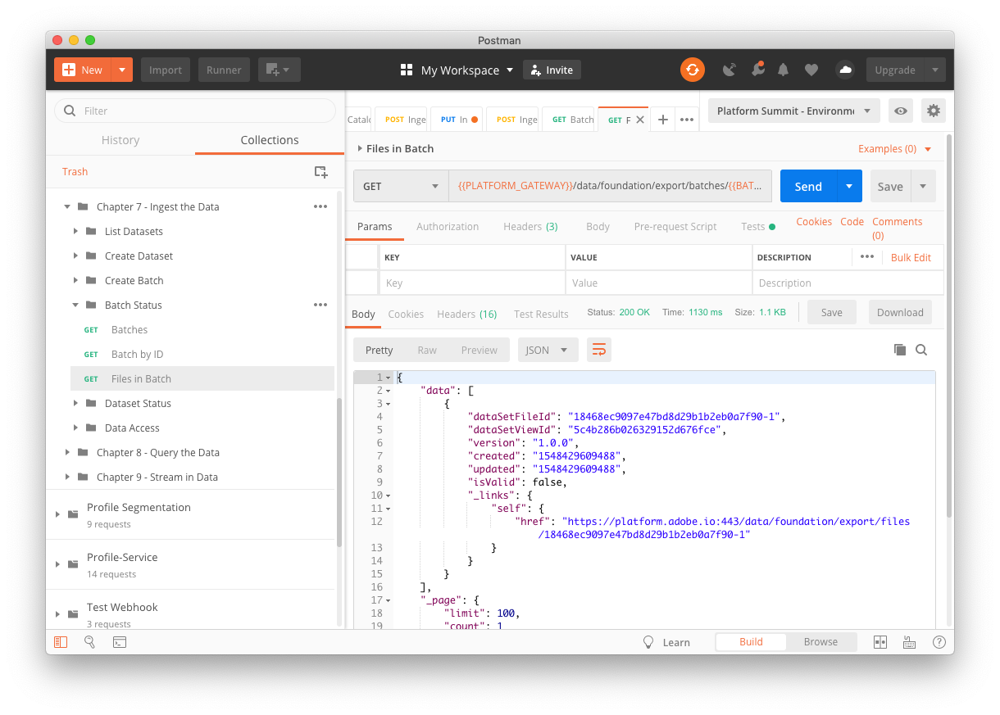

# Chapter 7. API: Ingest the Data

## Learning Objectives

- Learn how to ingest XDM-formatted data files
- Learn both the web UI and API interfaces
- Understand the data governance features of Experience Platform

## Lab Resources

- Experience Platform UI: [https://platform.adobe.com/](https://platform.adobe.com/)
- Sample data .parquet file in Profile XDM format: [ProfileDataSample.parquet](data/ProfileDataSample.parquet)

## Lab Tasks

- Ingest and explore a .parquet file in the Experience Platform UI
- Understand data governance options in Experience Platform UI
- Ingest and confirm a .parquet file in the Experience Platform API

## Story Part 1: Using the UI

To start the base of the loyalty program, most companies are likely to have existing customer data. Here, we will perform a batch ingestion of an existing data file that contains customer profiles, pre-formatted in Profile XDM format. From the perspective of an Analyst/Architect ("Archie"), this will allow us to start adding customer data to Experience Platform through the web UI interface, as well as preview the ingested datasets to confirm using a snapshot of the data that the file and data has been correctly imported. Some data files may not be properly formatted in to Profile XDM format - in which case, a data ingestion may come up as `failed`. In addition, some fields in our Profile schema may be sensitive information - for example, a customer's address and phone number. These will need to be export-controlled using data governance.

For batch ingestion of data, it is important that the data is properly formatted into XDM prior to bringing it into our customer loyalty database on Experience Platform. Conversion of non-formatted data into Profile XDM will not be covered here, but will be assumed to have been performed prior by a Data Engineer ("Joe").

---

## Story Part 2: Using the APIs

While using the UI for visualization and other tools are useful for Analysts/Architects, users like the Data Engineer ("Joe") and App Developer ("Adam") are likely to also utilize the Adobe Experience Cloud APIs to ingest data. This includes not just batch data of files, but also point-to-point connectors that could be transferring or streaming data from the sign-up forms for loyalty program, sign-in details from the login screen, as well as transactions from logged-in users using the company's website. We will implement these different data ingestion and lookup functions using the API, and demonstrate the tools available for integration of Experience Platform. When developing integrations and connections to Experience Platform from the Company's touch points for their customer loyalty program (sign-up forms, information changes, transaction history, web interactions), utilizing the APIs will facilitate an automatic method to establish new basis profiles, or to bring additional customer data into their basis profile.

Once customer profile data exists within the platform, integrations with the company's website as well as internal data science needs will require the ability to query the data on a point-to-point basis for profiles, as well as filtering and selecting segments (also covered in next steps). We will use the APIs to lookup a customer's profile or to filter through data.

---

## Steps

### Data Querying & Ingestion

1.  Building on the tasks we completed in [chapter 3](chapters/chapter-3.md) we'll create a dataset using our custom schema type and ingest some data.
1.  Start by expanding the `Chapter 7` & `List Datasets` folder in postman under `Adobe Experience Platform`.
1.  Skip over `Catalog: Get Datasets` and instead select the `Catalog: Get Datasets Limit 5` action and click `Send`.

    

    In the response pane you can scroll down and see the top five datasets. We are limiting the number of datasets returned to five in order have the query return quickly and not process too much data.

1.  Next let's run the `Catalog: Get Batches` action by selecting it and clicking `Send`.

    

    Datasets can consist of multiple batches.

1.  Finally let's run the `Catalog: Get Dataset Files` action by selecting it and clicking `Send`.

    

    In this case we'll get a list of files in the dataset and the metadata will include which batch it is from. Now that we've learned how to query datasets let's get busy creating one.

1.  Expand the `Create Dataset` folder in postman under `Chapter 7 - Ingest the Data`, select the `Catalog: Create Dataset` action and click `Send`.

    

    The call will create a new dataset and return a ID we can use in future calls. The `"unifiedProfile": ["enabled:true"]` flag within the body ensures that this dataset is automatically included in the Unified Profile Service, which we will detail more in Chapter 5.

    Remember that the DataSet is based on the schema you select like Profile.

    

    Once created it will conceptually look like this:

    

1.  Next we'll call `Catalog: Get Dataset` to inspect the dataset:

    

    In the response area of the postman call you view the datasets metadata.

1.  Now that we've successfully created a dataset we'll create a batch so we can start ingesting files.

    

    Expand the `Create Batch` folder, select `Ingest: Create Batch` and click `Send`:

    

1.  Next we'll upload a file to the batch.

    

    Select `Ingest: Upload File` then click on the `Body` tab.

    

1.  From there you'll need to select a file to upload by clicking on `Choose Files` and selecting [ProfileDataSample.parquet](data/ProfileDataSample.parquet).

    

    Then click `Send` to upload the file. If the upload succeeds you won't see anything in the response section other than a 200 OK.

1.  Since batches may contain multiple files we have to make an additional call to close off the batch to indicate that the batch is now ready for processing.

    

    So select the `Ingest: Close Batch` action and click `Send`.

    Once again you won't see anything in the response section of postman other than a 200 OK.

1.  If we've done everything right up until this point the file and batch should be successfully ingested. In order to check on that we'll open the `Batch Status` folder, select the `Batch by ID` action and click `Send`.

    

    In the response section pay close attention to the value of `status`. We want it to say `success` but if it says `processing` it just means we have to wait a bit and make this postman request again.

    In the meantime, this is what the response would look like _if_ the ingested file brings up a `failed` status - likely due to not being in the correct format for that dataset:

    

1.  Once we've seen the file in the batch has been successfully ingested we can check to see how many files are in the batch. Select the `Files in Batch` action and click `Send`.

    

    The response pane will show you how many files are in this batch. In our case there should only be one file.

1.  Let's walk back up the containers and check on the status of our dataset. Expand the `Dataset Status` folder, select the `Catalog: Get Dataset` action and click `Send`.

    

    Scroll down in the response pane until you find `lastBatchStatus` property which should read as `success`.

1.  Things are looking good for our dataset but what if we want to get more information about the files stored in the dataset. Then we open the `Data Access` folder, select `Data Export: Get File Details` action and hit `Send`.

    

    This response contains important metadata like the file name and file size.

1.  Finally, let's take a look at the file stored in data services.

    

    Select the `Data Export: Get File` action and hitting `Send`.

    

    In this case the response is not that useful to us as .parquet files are binary in format so they are difficult to read. However, it should make customers happy to know whatever data they import into data services can be exported as well.

Well that was a lot of work to ingest the data. Let's move on to the next step which is segmenting the data and targeting specific users.

---

### Navigate

**Previous:** Chapter 6 - [API: Define the Schema](chapter-6.md)
**Next:** Chapter 8 - [Technical: Query the Data](chapter-8.md)
