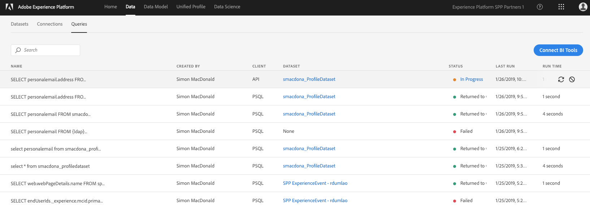

# Chapter 8. Technical: Query the Data

## Learning Objectives

- Understand the uses of the Query Service
- Connect a client to the Query Service
- Running Queries
- Generating Datasets from Query Results

## Lab Resources

- Experience Platform UI: [https://platform.adobe.com/](https://platform.adobe.com/)

## Lab Tasks

- Connect a client to the Query Service
- Examine Datasets
- Running Queries
- Generating Datasets from Query Results

---

## Story

Query Service gives you the ability to use standard SQL to query data in Adobe Experience Platform to support many different use cases. It is a serverless tool which allows you to join any datasets in Experience Data Lake and capture the query results as a new dataset for use in reporting, Data Science Workspace, or for ingestion into Profile Service.

---

## Steps

### Connect a client to the Query Service

1.  For this lab we are going to use PostgreSQL to connect to the query service.

    For **MacOS** users:

    Open a terminal window and issue these three commands:

        /usr/bin/ruby -e "$(curl -fsSL https://raw.githubusercontent.com/Homebrew/install/master/install)"
        brew install postgres
        which psql

    You should see the following if it worked correctly:

        /usr/local/bin/psql

    For **Windows** users:

    Download and install [PostgreSQL](https://www.postgresql.org/download/windows/)

    After installation you will need to edit your path variable:

    

    You need to add the two lines shown that include "Postgres". Save your updates, then open a Command prompt and type this:

        psql -V

    You should see something like this:

        psql (PostgreSQL) 9.5.14

1.  Connect to the platform web site: [https://platform.adobe.com](https://platform.adobe.com)

    Browse to the "Data" tab:

    

1.  Then click the "Queries" tab:

    

1.  Click on the "Connect BI Tools" page. Then click "copy" for "PSQL Command".

    

1.  Now paste the command string into a terminal/command window and press return. You should see a result like this:

            psql (11.1, server 0.1.0)
            SSL connection (protocol: TLSv1.2, cipher: ECDHE-RSA-AES256-GCM-SHA384, bits: 256, compression: off)
            Type "help" for help.

            all=>

    If you don't see at least version 10.5 of psql then you need to download an updated version.

### Examine Datasets

1. Seeing available tables with PostgreSQL `\d` vs `SHOW TABLES;`

   `\d` gives you the standard PostgreSQL view

   

   `SHOW TABLES;` is a custom command we have added that gives you a more detailed view and presents the table as well as the DataSet.

   

1. Check the tables root schema details with PostgreSQL `\d table_name`. The schema presented is just the root fields most of which are complex, structured types as you say in the DataSet schema UI.

   

1. Open [https://platform.adobe.com/datasets](https://platform.adobe.com/datasets), click on the `Data` tab and from the Dataset list click on the profile dataset you created and then the schema tab.

   

### Running Queries

1.  Now we can run queries against the profile dataset we ingested in chapter 7. Run this SQL statement, and substitute your participant name for {ldap}.

        SELECT personalemail
        FROM {ldap}_profiledataset
        WHERE personalemail IS NOT NULL
        LIMIT 10;

1.  Notice anything about the result? It produced a flattened object rather than returning a single value. The `personalemail` object contains these six parameters primary, address, label, type, status and statusReason. And when the column is only delcared down to the object it will return the entire object as a string. The XDM schema is more complex than what you may have had experience with before because we need to cover multiple solutions, channels, and use-cases. If you just wanted the ID value you would use:

        SELECT personalemail.address
        FROM {ldap}_profiledataset
        WHERE personalemail IS NOT NULL
        LIMIT 10;

    

### Generating Datasets from Query Results

1. Now go back into the Experience Platform UI, click on the Data tab, then Queries.
1. Find the query you previously ran to find all the email addresses. Hove over the row and click on the Create Dataset button.

   

1. Enter a dataset name, prepended with your LDAP ID (does not have to be unique or SQL-safe, the system generates a "table name" based on the name given here). Enter a dataset description and click `Run Query`.

   

1. This submits a request to create a dataset:

   

   which then runs:

   

   until completion:

   

1. Now got back to the Datasets tab and you will see you custom dataset:

   

1. Click on the name of your dataset and then the Preview button:

   

1. You'll see the same data that you previously queried in psql.

   

---

### Navigate

**Previous:** Chapter 7 - [API: Ingest the Data](chapter-7.md)
**Next:** Chapter 9 - [Technical: Stream in Data](chapter-9.md)
