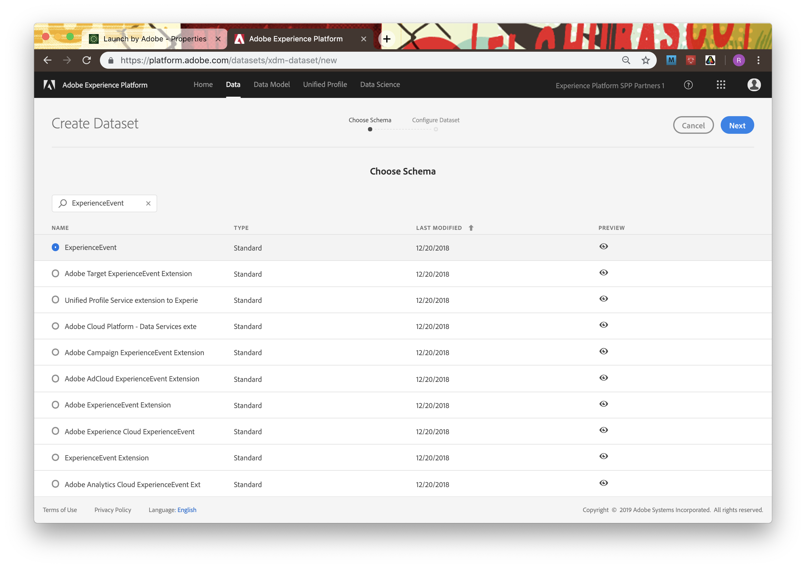
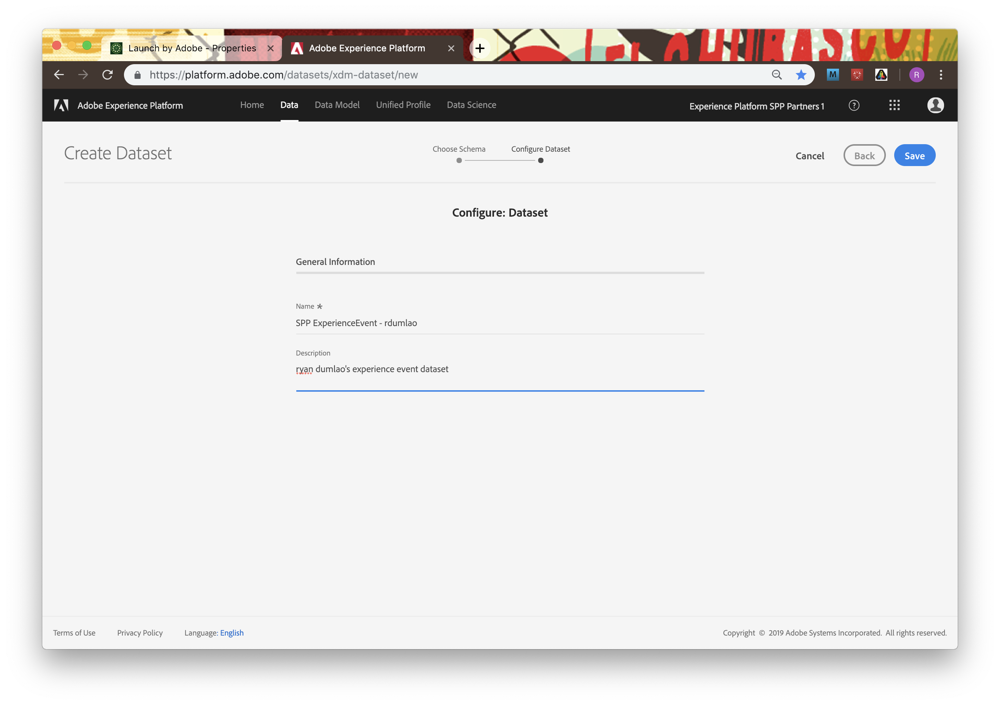

# Chapter 9. Technical: Stream in Data via Launch

## Learning Objectives

- Learn how to integrate Adobe Experience Platform Launch onto a webpage
- Create Launch rules to stream data to Experience Platform

## Lab Resources

- Launch URL:

## Lab Tasks

- Deploy webpage on local server
- Create Launch property and add streaming endpoint to webpage
- Create data element and rule to stream a data beacon into Experience Platform
- Observe the beacon firing, and landing in Experience Platform

---

## Story

---

## Steps

=======

### Deploying webpage to your machine

1.  Download the [WeTravel website](../data/WeTravel-local.zip).
1.  Unzip the `WeTravel-local.zip` file and make note of which directory you extract the content to.
1.  Start the Fenix web server.

    

1.  Select the `Web Servers` menu and click `New`

    

1.  Use `WeTravel` as descriptive name.

    

1.  Click on the folder in the `Directory` input field. Then navigate the file dialog to the directory you unzipped the `WeTravel-local` folder, highlight it and click `Select`.

    

1.  Click `Create`.

    

1.  Click on the `Play` button to start the server.

    

1.  Now your WeTravel site should be ready to be browsed.

    

1.  Navigate to [http://127.0.0.1](http://127.0.0.1) to test the web server. You should see the following:

    

1.  Now we need to redirect requests to `we-travel.com` to our local web server.

    For **MacOS** users:

    - Open the Terminal program.
    - Run the following command:

              sudo nano /etc/hosts

      - You will need to type in your adminstrator password to continue.

      

      - You're now in the Nano text editor. You should see something that looks like this:
      - Use the arrow keys to navigate the cursor to the line:

              127.0.0.1  localhost

      

      - Add `we-travel.com` to the end of the line so it looks like:

              127.0.0.1  localhost   we-travel.com

      

      - Once you're done, hold down the control and O keys to save the file, then control and X to exit.
      - Finally you'll need to restart your Mac's DNS responder by entering the following command into the Terminal:

              sudo killall -HUP mDNSResponder

    For **Windows** users:

    - Press the Windows key.
    - Type **Code** in the search field.
    - In the search results, right-click **Code** and select **Run as administrator**.
      From **Code**, open the following file:

            c:\Windows\System32\Drivers\etc\hosts

    - Add a new line to the end of the file that looks like this:

            127.0.0.1   we-travel.com

    - Click File > Save to save your changes.

1.  Navigate to [http://we-travel.com](http://we-travel.com) to test the web server. You should see the following:

    

### Setting up Adobe Launch

Some elements of Launch are pre-packaged for sake of time.

1. Create datasets on Platform, "SPP ExperienceEvent - first/last" and Profile

    

    

    

1. Open launch at https://launch-demo.adobe.com
1. Login, go to SPP 1 org
1. Find the property associated with your user number and open it

    

1. copy Development install link from web install

    

    

1. paste this into the header of your SPA (for later)

    

1. Look through data elements, see ones already made. We will create one to send the language of our browser to Platform

    

1. Add data element, create with:
  a.  Name: Language
  b.  Extension: Core
  c.  Data Element Type: JavaScript Variable
  d.  Path to variable: navigator.language

    

1. look at Working Library build status til green

    

1. Go to extensions, see EC, EP extensions, open config for EP

    

1. Create streaming endpoint, name it "Launch Streaming Endpoint - first/last", with Sourcei = "Launch-first/last"

    

1. Go to rules. see what exists. look into "Page Visit" - event is "Page Bottom" (this is for experienceevent)

    

1. look at actions. see flow.

    

1. Click on Experience Cloud ID Service. see that it is setting ECID from what is being sent to it, save and go back

    

1. Click on Experience Platform Send Beacon

    

1. Select your dataset from dataset list. note the schema nad dataset ID

    

1. Add another element to send in beacon - "environment.browserDetails.acceptLanguage" with value "%Language%" chosen from the list

    

    

1. Keep changes -> save and build
1. same with Sign Up rule (this is for Profile)

    

1. look at event - click when sign up. look at action for AEP - select correct dataset on beacon rule

    

1. Explore the actions for this rule. Correct the "personalEmail.address" field to "%Email Address%

    

    

1. save to library and build

    

done setting up! now let's insert this into our SPA

1. Go to your SPA, open inspector, to network tab
1. refresh the page
1. filter by "dcs" until you find your endpoint
1. look at payload, expand the fields. observe all the becaon data from Page View
1. sign up. click sign-up, look at payload. observe your profile data being sent
1. copy your ECID
1. do Profile API lookup on Postman using email
1. do ExperienceEvent API lookup on Postman using ECID
1. go to monitoring tab, check unified profile ingestion

### Streaming a Launch data beacon into Platform

---

### Navigate

**Previous:** Chapter 8 - [Technical: Query the Data](chapter-8.md)
