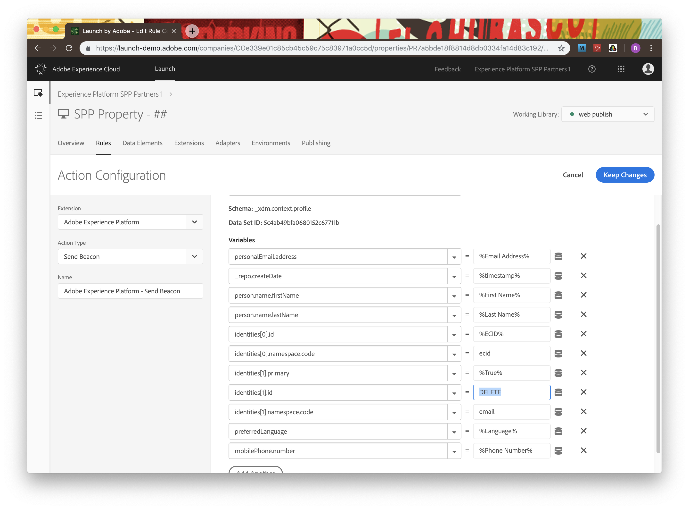
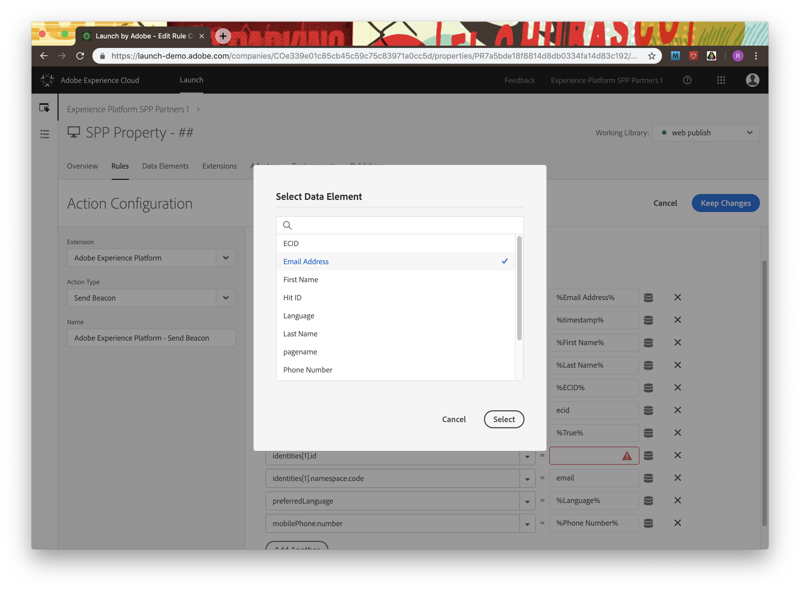

# Chapter 9. Technical: Stream in Data via Launch

## Learning Objectives

- Learn how to integrate Adobe Experience Platform Launch onto a webpage
- Create Launch rules to stream data to Experience Platform

## Lab Resources

- Launch URL: https://launch-demo.adobe.com

## Lab Tasks

- Deploy webpage on local server
- Create Launch property and add streaming endpoint to webpage
- Create data element and rule to stream a data beacon into Experience Platform
- Observe the beacon firing, and landing in Experience Platform

---

## Story

---

## Steps

=======

### Deploying webpage to your machine

1.  Download the [WeTravel website](../data/WeTravel-local.zip).
1.  Unzip the `WeTravel-local.zip` file and make note of which directory you extract the content to.
1.  Start the Fenix web server.

    

1.  Select the `Web Servers` menu and click `New`

    

1.  Use `WeTravel` as descriptive name.

    

1.  Click on the folder in the `Directory` input field. Then navigate the file dialog to the directory you unzipped the `WeTravel-local` folder, highlight it and click `Select`.

    

1.  Click `Create`.

    

1.  Click on the `Play` button to start the server.

    

1.  Now your WeTravel site should be ready to be browsed.

    

1.  Navigate to [http://127.0.0.1](http://127.0.0.1) to test the web server. You should see the following:

    

1.  Now we need to redirect requests to `we-travel.com` to our local web server.

    For **MacOS** users:

    - Open the Terminal program.
    - Run the following command:

              sudo nano /etc/hosts

      - You will need to type in your adminstrator password to continue.

      

      - You're now in the Nano text editor. You should see something that looks like this:
      - Use the arrow keys to navigate the cursor to the line:

              127.0.0.1  localhost

      

      - Add `we-travel.com` to the end of the line so it looks like:

              127.0.0.1  localhost   we-travel.com

      

      - Once you're done, hold down the control and O keys to save the file, then control and X to exit.
      - Finally you'll need to restart your Mac's DNS responder by entering the following command into the Terminal:

              sudo killall -HUP mDNSResponder

    For **Windows** users:

    - Press the Windows key.
    - Type **Code** in the search field.
    - In the search results, right-click **Code** and select **Run as administrator**.
      From **Code**, open the following file:

            c:\Windows\System32\Drivers\etc\hosts

    - Add a new line to the end of the file that looks like this:

            127.0.0.1   we-travel.com

    - Click File > Save to save your changes.

1.  Navigate to [http://we-travel.com](http://we-travel.com) to test the web server. You should see the following:

    

### Setting up Adobe Launch

Some elements of Launch are pre-packaged for sake of time.

#### Creating a Launch property, data elements, and rules

1. We will be re-using the datasets we created with the UI in Chapter 3, which are "SPP Profile - [first initial, last name]" and "SPP ExperienceEvent - [first initial, last name]".

    

1. Open Adobe Experience Platform Launch at https://launch-demo.adobe.com
1. Login with yout Adobe ID, and ensure in the top right Organization selector that you are in "Experience Platform SPP Partners 1"
1. Find the property associated with your user number ("SPP Property - ##") and open it. This property points to the URL "we-travel.com", which is now set up on your local machine from the previous steps in this chapter. The property will open up and take you to the Launch property home screen.

    

    

1. First, we need to take a snippet of HTML to insert in your WeTravel site. This snippet will be how Launch sends data to the Experience Platform. Click the "Environments" tab from the home screen, and then click the small box icon to the right of the "Development" row.

    

1. Click the "copy" square button to the right of the script textbox to copy this snippet to the clipboard.

    

1. Open up the "index.html" and "login.html" pages of your WeTravel site in your text.code edtior, and paste this code into the <head> tags of each file. This will enable Launch to run its rules on these two pages. _Remember to paste this snippet in BOTH files.

    

    

1. Go to the "Data Elements" tab. This is where we will define elements from our WeTravel site to pull in values - names, emails, IDs, descriptors, etc. There are already a few populated in here that we will be using when we send data to Experience Platform. Here, we will create a new Data Element to record the language of our browser.

    

1. Click the "Add Data Element" button. The create screen will open; create your element with the following properties (matching the screenshot):
   1.  Name: Language - _This is the name that we will refer to when sending data elements_
   1.  Extension: Core - _The "Core" extension is the base extension for Launch; more extensions can be added for different use cases_
   1.  Data Element Type: JavaScript Variable - _This is the type of value we are looking for within the WeTravel page to populate the data element_
   1.  Path to variable: navigator.language - _This is the specific JavaScript Variable (determined by Data Element Type) to look for within our WeTravel site_

    

1. Click "Save to Library and Build" and wait until the status in the top right turns to green, indicating a successful build.

    

1. Let's take a look at the extensions we will need for our WeTravel site. Click the "Extensions" tab. You'll see that the Core extension is there by default, and that we've already had the following extensions installed:
   1. Adobe Experience Platform - _This is the extension needed to send data specifically to our Experience Platform instance_
   1. Experience Cloud ID Service - _This is the extension that allows us to identify the unique Experience Cloud ID attribute across all Adobe products_

    

1. We're going to need to configure the Adobe Experience Platform extension, so click "Config" on that box. Click on "Create a streaming endpoint", and name it "Launch Streaming Endpoint - [first initial / last name]", with Source ID = "Launch-[firstinitial / last name]", and then click "Save".

    

1. Now, we have our streaming endpoint from our WeTravel site into Experience Platform defined and ready to go. The next step is to create triggers that will make actions happen on our WeTravel site. Go to the  "Rules" tab. Take alook at the existing rules - we have two defined here. Look into "Page Visit".

    

1. You can see that the Event, "Core - Page Bottom" is triggered when the browser hits the bottom of the page. This stands in as a de-facto "page view" as the bottom of the page is automatically hit when the page renders. At the bottom, the Action flow shows two actions - one for Experience Cloud ID Service, and then  one for Adobe Experience Platform.

    

1. Click on the Experience Cloud ID Service action. You can see that it is setting the ECID to share across Adobe solutions with the ECID being sent to it from our "ECID" Data Element. Click "Cancel" and "Discard changes" (don't worry, no changes were made) to go back to the Rule editor.

    

1. Now let's define data that we send to Experience Platform. Click on "Adobe Experience Platform - Send Beacon". This action is sending an ExperienceEvent. You'll see that some of the variables and data elements populating those variables are already set - sending the ECID as an identity for the event, the name of the webpage currently viewed, and a timestamp of that action.

    

1. There are two things here that we need to change. First, the dataset selected that we're sending data too needs to but changed. Click the dropdown and find your corresponding "SPP ExperienceEvent - [name]" dataset from earlier. Note that the Schema and Data Set ID fields are set to match the selected dataset.

    

1. Now let's add another variable to send in our beacon - the Language data element that we created earlier. Click on "Add Another" and create the following:
   1. variable: environment.browserDetails.acceptLanguage
   1. value: %Language% - _(Selected this from the list of data elements by clicking the round stack icon next to the value field. It can also be typed in directly)_

    

    

1. Let's save our changes. Click on "Keep Changes" to save our Action, and then "Save to Library and Build"

1. We just set up our first rule to send an ExperienceEvent to Platform! Now let's do the same thing for same with Profile data, by taking a look at the "Sign Up" rule. Clicking on "Core - Click" you can see the composition of the event that we're looking for - a click on the "Submit" button during sign-up.

    

    

1. Just like we did with the ExperienceEvent dataset, we need to select the correct dataset. Since this is a Profile-updating action, we want to send our data beacon to our "SPP - Profile [name]" dataset, so select that from the dropdown.

    

1. Explore the actions for this rule, as there are several already pre-populated. You'll notice that we are sending the following variables:
   1. personalEmail.address
   1. \_repo.createDate
   1. person.name.firstName
   1. person.name.lastName
   1. identities[0].id
   1. identities[0].id.namespace.code
   1. identities[0].id.primary
   1. identities[0].id
   1. identities[0].id.namespace.code
   1. preferredLanguage
   1. mobilePhone.number

   You'll also see that the "identities[1].id" value is "DELETE" and needs to be corrected. This value sets one of the identities that Unified Profile uses to match XDM data to each other. Clear this text box and then select the "Email Address" data element using the round stack icon next to the text box.

    

    

1. Click "Keep Changes" on the action, and thten "Save to Library and Build" on the rule. Click on the "Publishing" tab to watch the status of our build and see it succeed.

    

### Streaming a Launch data beacon into Platform from WeTravel

Now we've got a Launch property setup, and a WeTravel instance running with the Launch streaming endpoint included. Let's watch it stream data into Experience Platform.

1. Go to https://www.we-travel.com. This should be pointing to your Fenix webserver instance of We-Travel. Right click and open up "Inspect" to see the page inspector.

    

1. Go to the "Network" tab, and type "dcs" into the filter box. This will filter our network commands being sent to the Launch streaming URL. Refresh the page.

1. Select the endpoint under "Name" and scroll dwon on the right pane to "Request Payload". You should see an expandable JSON payload starting with `{header: `. Expand all these fields and you will be able to see the XDM data that we defined in our Launch rule for "Page View" being sent from the page to Launch.

    

1. Go back to your WeTravel screen. Now let's see our Sign-Up rule in action by going to "Login" in the top right of the page. Scroll down to the sign-up form and fill in some dummy details with your name and email. These do not have to be real or accurate.

    

1. Click "Sign In". You will see an "Aw snap!" error, but please ignore this; our instance of WeTravel is stripped-down and does not contain any functionality past this page. Go back to your inspector and you can now observe two Launch beacons being sent!

1. One beacon data contains the Profile XDM data we filled into the form. You can see all the fields we defined in the "Sign Up" rule on Launch here.

    

1. The other beacon is an ExperienceEvent XDM fired by the "Page View" rule, the same as when we were at the WeTravel Homepage. You'll notice the data for this page is basically identical, except for the `webPageDetails` and `timestamp` fields.

    
    
1. We can also look at all of our ExperienceEvent data within Experience Platform using an API call through Postman. Within the beacon data, find the `mcid: {id: "##"` field and select your ECID. This ID is specific to your browser session and can be used to look up ExperienceEvent and Unified Profile data.

    

1. Go to Postman, and under the Chapter 9 collection find the `experienceevent point lookup` call. find the `entityId` Field and paste your copied ECID here from the clipboard. Make sure that the `entityIdNS` field is set to "ecid". Send the `GET` call.

 	

1. You should get back a list of all ExperienceEvents associated with your ECID - browsing the homepage and the signup page. Take a look, your streaming data is now in Experience Platform!

 	

1. This data is now in Experience Platform, but it go to monitoring tab, check unified profile ingestion

---

### Navigate

**Previous:** Chapter 8 - [Technical: Query the Data](chapter-8.md)

**Return Home:** [Workbook Index](../README.md)
